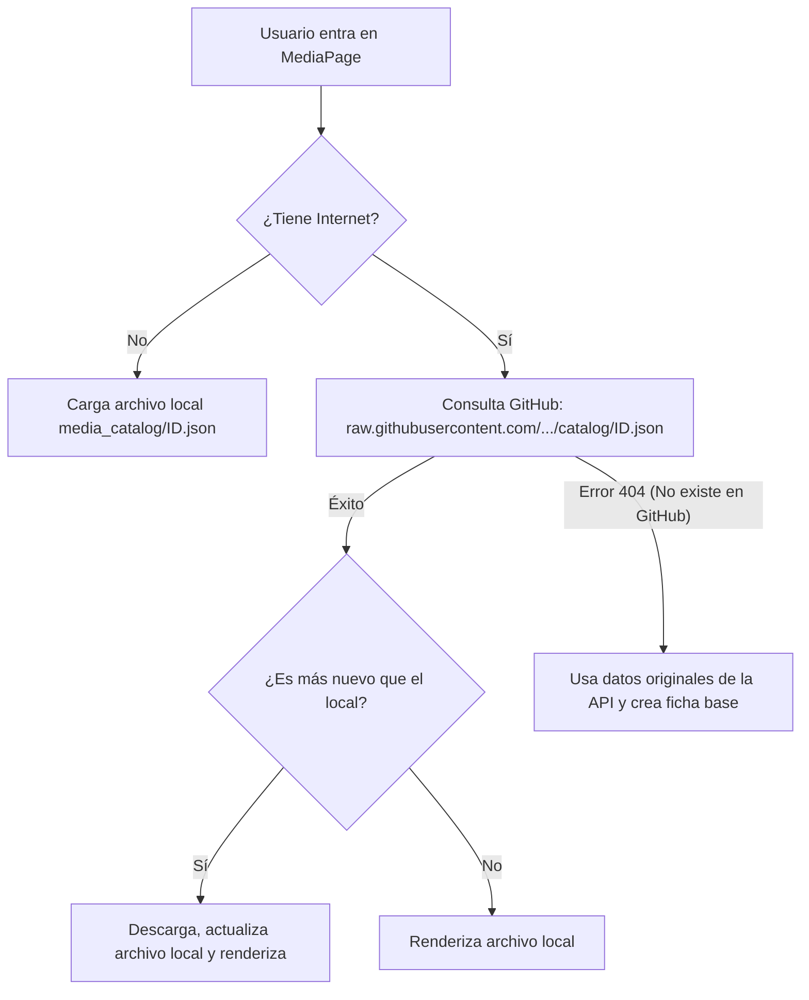

# Propuesta: Base de Datos de Catálogo Colaborativa y Offline-First (Basada en Git/GitHub)

Este documento describe la arquitectura y el diseño técnico propuesto para permitir la edición colaborativa de fichas de medios (añadir personajes, corregir metadatos, etc.) en **Metadea** sin depender de un servidor de base de datos en línea y manteniendo la filosofía *offline-first*.

---

## 1. Concepto General y Filosofía
En lugar de alojar una base de datos centralizada (como PostgreSQL o Firebase) que requiere mantenimiento, servidores activos y costes de hosting, utilizaremos **GitHub como nuestra base de datos distribuida y de control de calidad**.

* **Lectura offline-first**: Los metadatos de las obras se leen de forma local e individual.
* **Carga ultra-rápida (bajo demanda)**: Cada obra se guarda en su propio archivo JSON independiente.
* **Flujo colaborativo**: Los usuarios envían propuestas directamente desde la aplicación mediante la creación de Pull Requests (PR) automatizadas en GitHub.
* **Panel de administración integrado**: El administrador del proyecto puede revisar, aprobar y fusionar estas propuestas desde un panel de moderación en la propia interfaz de Metadea.

---

## 2. Arquitectura de Archivos Individuales (Catálogo Separado)
Para evitar archivos monolíticos gigantescos que ralenticen el buscador o consuman exceso de memoria, el catálogo local del usuario mantendrá la estructura actual de **un archivo JSON independiente por obra** en el directorio de datos de la app:

```
AppData/Local/com.metadea.app/media_catalog/
  ├── igdb-1025.json      # Ficha del videojuego Zelda Ocarina of Time
  ├── anilist-12345.json  # Ficha de un Anime
  └── tmdb-98765.json     # Ficha de una Película
```

### Estructura de la Ficha (`MediaCatalogEntry` ampliado)
Tanto en el struct de Rust como en la interfaz de TypeScript, añadiremos el soporte para personajes y datos aportados por la comunidad:

```typescript
export interface MediaCatalogEntry {
  external_id: string;   // ej. "igdb-1025"
  type: 'anime' | 'manga' | 'game' | 'series' | 'movie' | 'book';
  title_main: string;
  cover_url?: string;
  // ... metadatos estándar ...
  
  // Nuevos campos colaborativos
  characters?: Array<{
    name: string;
    role: 'main' | 'supporting' | 'cameo';
    image_url?: string;
  }>;
  custom_data?: {
    developers?: string[];
    publishers?: string[];
    trivia?: string;
  };
}
```

---

## 3. Flujo de Lectura y Sincronización Inteligente
Cuando el usuario entra a la pantalla de detalle de una obra (`MediaPage.tsx`):



* **Rendimiento**: Al ser archivos individuales que ocupan apenas 2-3 KB, la sincronización se realiza en segundo plano mediante un simple `fetch` HTTP de menos de 50ms.

---

## 4. Flujo de Contribución: Crear una PR desde la App
Cuando un usuario añade personajes a una obra y pulsa **"Enviar propuesta a la comunidad"**:

1. **Autenticación (GitHub Token)**:
   * El colaborador introduce su Token de Acceso Personal (PAT) de GitHub en los Ajustes de la App (o se implementa un inicio de sesión rápido por OAuth).
2. **Generación de la propuesta (API de GitHub)**:
   La app ejecuta las siguientes llamadas HTTPS contra `api.github.com`:
   * **Paso A**: Crea una rama (*branch*) en tu repositorio con un nombre único:
     `POST /repos/Shadorossa/Metadea/git/refs` (ej. `refs/heads/proposals/igdb-1025-user123`)
   * **Paso B**: Sube el archivo JSON modificado (`catalog/igdb-1025.json`) a esa rama:
     `PUT /repos/Shadorossa/Metadea/contents/catalog/igdb-1025.json`
   * **Paso C**: Abre una Pull Request (PR) dirigida a la rama `main` de tu repositorio:
     `POST /repos/Shadorossa/Metadea/pulls` con el título *"Propuesta de personajes para Zelda por @usuario"*.

---

## 5. Panel de Moderación y Aprobación en la App (Para Ti)
En la sección de configuración de Metadea, se añadirá una pestaña exclusiva de **"Moderación"** visible únicamente si el usuario autenticado coincide con el propietario del repositorio (`Shadorossa`).

### Interfaz del Panel
* **Lista de propuestas**: La aplicación descarga las PRs abiertas consultando `GET /repos/Shadorossa/Metadea/pulls`.
* **Comparador de cambios (Diff)**: Muestra en verde los personajes añadidos y en rojo los modificados/eliminados en comparación con tu catálogo actual.
* **Control total**:
  * **Botón [Aprobar y Fusionar]**: Llama a `PUT /repos/Shadorossa/Metadea/pulls/{numero_pr}/merge`. GitHub fusiona el JSON a tu rama `main` y la PR se cierra con éxito.
  * **Botón [Rechazar]**: Llama a `PATCH /repos/Shadorossa/Metadea/pulls/{numero_pr}` con estado `"closed"`.

---

## 6. Búsqueda y Priorización de Catálogo Local
Para que las obras extendidas por la comunidad tengan preferencia frente a los datos en bruto devueltos por las APIs:

1. Al realizar una búsqueda en la app, se realiza una búsqueda de texto completo rápida en la carpeta local `media_catalog/` (usando el motor indexador que ya implementa Metadea en Rust).
2. Se consultan las APIs externas para rellenar vacíos.
3. **Fusión**: Si un resultado de la API externa coincide en ID con una ficha local guardada en `media_catalog/`, se descarta el resultado de la API y se le da prioridad a la ficha local enriquecida con los personajes y metadatos verificados.
4. Las obras verificadas localmente se muestran con un distintivo visual (ej. un icono de check dorado o "Verificado por la Comunidad").
